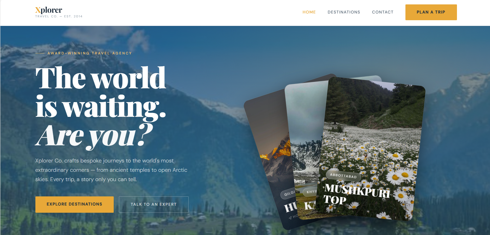

# 🌍 Xplorer Co. – Travel Agency Website

A modern and responsive travel agency landing page showcasing the breathtaking beauty of Pakistan's northern destinations. The project focuses on elegant UI/UX, responsive layouts, smooth animations, and visually immersive travel experiences.

> Designed to demonstrate front-end development skills using HTML, CSS, JavaScript, and Bootstrap while incorporating AI-assisted development for faster ideation and refinement.

---

## 📸 Preview

> Add a screenshot of your homepage here.



---

## 🌐 Live Demo

🔗 **Live Website:** https://raibayub.github.io/xplorer-co/

📂 **GitHub Repository:** https://github.com/raibayub/xplorer-co

## ✨ Features

- 🎨 Modern and elegant travel website design
- 📱 Fully responsive layout
- 🚀 Smooth scrolling navigation
- 📊 Animated statistics counter
- 🃏 Interactive destination cards
- 🎯 Call-to-action sections
- 📩 Contact form
- 🌄 High-quality travel imagery
- ⚡ Fast and lightweight
- 💻 Clean and organized code structure

---

## 🛠️ Built With

- HTML5
- CSS3
- JavaScript (ES6)
- Bootstrap 5
- Bootstrap Icons
- Google Fonts

---

## 🤖 AI Assisted Development

This project was enhanced with the assistance of AI during development for:

- UI/UX design refinement
- Code optimization
- Layout improvements
- Responsive design suggestions
- Animation ideas
- Content refinement
- Development guidance and debugging

> AI was used as a development assistant, while the project structure, implementation, customization, testing, and final integration were completed manually.

---

## 📂 Project Structure

```
Xplorer-Co/
│
├── images/
│   ├── hunza.jpg
│   ├── kajri.jpg
│   ├── k2.jpg
│   ├── malam-jabba.jpg
│   ├── babusar-top.jpg
│   └── ...
│
├── index.html
├── style.css
├── script.js
└── README.md
```

---

## 🚀 Getting Started

1. Clone the repository

```bash
git clone https://github.com/raibayub/xplorer-co.git
```

2. Open the project folder.

3. Run `index.html` in your browser.

No additional installation is required.

---

## 💡 Future Improvements

- Destination search
- Booking system
- Dark/Light theme toggle
- Weather API integration
- Google Maps integration
- Seasonal destination filtering
- Backend integration using Node.js & Express
- Database support with MongoDB
- User authentication

---

## 👩‍💻 Author

**Raiba Ayub**

Aspiring MERN Stack Developer

GitHub: https://github.com/raibayub

---

## ⭐ If you like this project

Give it a ⭐ on GitHub!
